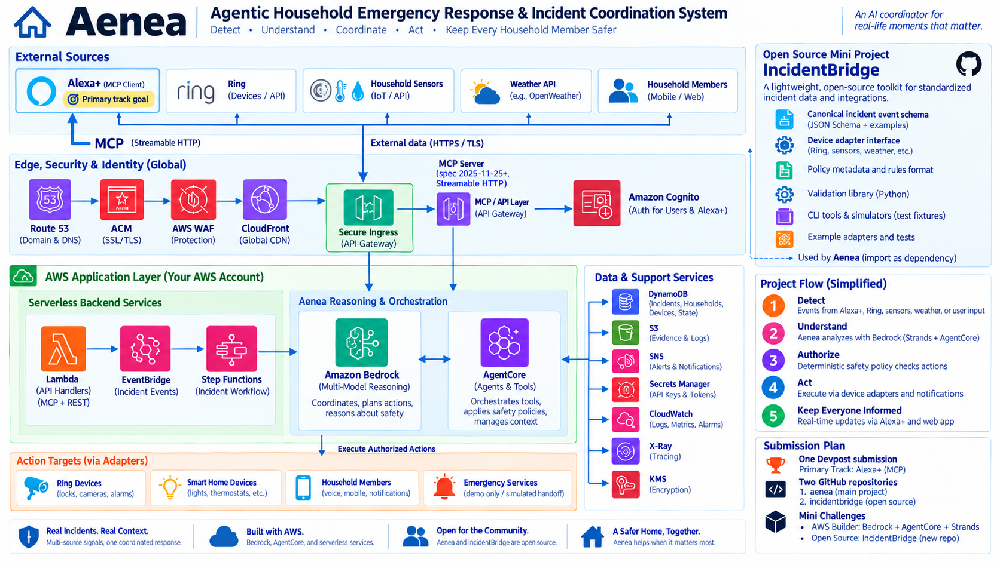

# Aenea

Shared household context, accountable incident coordination.

Aenea explores an Alexa+-centered response to disconnected household alerts. Simulated device signals enter a cloud incident pipeline; a Strands/Bedrock agent assesses the evidence, while deterministic policy controls virtual actions. An Alexa+ browser experience uses MCP tools to coordinate the same saved incident, household reports and handoff.

> Hackathon prototype, not a certified alarm, medical device or monitoring service. Follow official alarms and emergency guidance. Devices and actions are simulated; Aenea does not dispatch responders or provide a verified native Alexa/Ring integration.

## Explore the experience

Open [Aenea](https://aenea.qleam.com) and follow the [judge guide](docs/judge-guide.md). Final hosted acceptance is still pending.

- **Settings:** name locations, manage simulated devices and set virtual action permissions.
- **Simulation Studio:** save named single alerts and multi-device scenarios; edit or delete reusable definitions.
- **Command Center:** select saved simulations, combine non-overlapping devices and trigger alerts beside the live briefing and map.
- **Incident review:** inspect evidence revisions, citations, uncertainty, policy outcomes and human reviews.
- **Alexa+ coordination:** ask supported commands, record synthetic check-ins and approve eligible actions.
- **Handoff:** review and copy/print a bounded incident summary; nothing is sent to responders.
- **Data controls:** request guarded incident cleanup and track its status.

New evidence makes an older assessment ineligible for new actions. Human agreement does not bypass policy or replace explicit action approval. Camera motion does not establish occupancy or safety.

## Architecture

This unchanged owner-selected v1 diagram is a design baseline. Vendor labels are simulated categories, not connected products. [Architecture notes](docs/architecture.md) describe current implementation and limits.

| Source | Responsibility |
| --- | --- |
| `apps/web` | React workspace and Alexa+ browser simulator |
| `functions`, `shared` | Ingestion, evidence revisions, policy, review, tools and cleanup |
| `agent/reasoner` | AgentCore-hosted Strands/Bedrock assessment |
| `services/mcp` | Authenticated MCP 2025-11-25 Streamable HTTP server |
| `infra`, `workflows` | Terraform infrastructure and event orchestration |
| `tests` | Offline regression coverage |

[IncidentBridge](https://github.com/tanvir4hmed/incidentbridge) is a separately licensed event toolkit consumed by the ingress path.

## Build and release status

The nine [workspace improvement phases](docs/workspace-refresh.md) have source/release-documentation implementation. This does **not** mean hosted acceptance or contest submission is complete. Recorded offline checks include 44 Python regressions, six JavaScript checks and frontend builds across the relevant phases; see [evidence and its limits](docs/build-evidence.md).

Deployment is owned by GitHub Actions. [Cloud setup](docs/deployment.md) and [bootstrap](docs/cloudshell-bootstrap.md) describe operator configuration. Pushes select affected frontend, Lambda, infrastructure or agent components. Documentation-only changes do not deploy.

## Documentation

- [User/judge walkthrough](docs/judge-guide.md) · [in-app guide](https://aenea.qleam.com/guide)
- [Current phases](docs/workspace-refresh.md) · [project history](docs/project-timeline.md)
- [Incident-first remediation and Command Center roadmap](docs/incident-first-roadmap.md)
- [MCP and authentication](docs/alexa-mcp.md) · [AWS integration](docs/aws-builder.md)
- [Release gates](docs/release-checklist.md) · [submission draft](docs/submission-draft.md)
- [Demo runbook](docs/demo-runbook.md) · [product feedback](docs/product-feedback.md) · [friction log](docs/friction-log.md)
- [Operations](docs/operations.md) · [safety](docs/safety.md) · [security](SECURITY.md)
- [Contributing](CONTRIBUTING.md) · [third-party notices](THIRD_PARTY_NOTICES.md)

## License

[Apache License 2.0](LICENSE).
