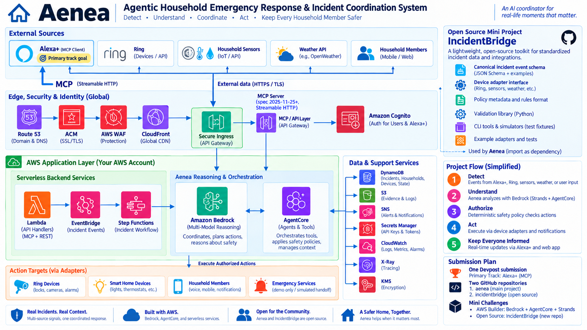

# Aenea

Shared household context, accountable incident coordination.

Aenea explores an Alexa+-centered response to disconnected household alerts. Scheduled simulated device states enter a shared cloud incident pipeline; a Strands/Bedrock agent assesses evidence, while deterministic policy controls location-scoped virtual actions. The Alexa+ browser experience reads the same incidents through MCP and application APIs, with persisted briefings and optional notes.

> Hackathon prototype, not a certified alarm, medical device or monitoring service. Follow official alarms and emergency guidance. Devices and actions are simulated; Aenea does not dispatch responders or provide a verified native Alexa/Ring integration.

## Explore the experience

Open [Aenea](https://aenea.qleam.com) and follow the [judge guide](docs/judge-guide.md). Final hosted acceptance is still pending.

- **Settings:** name locations, manage simulated devices and set virtual action permissions.
- **Simulation Studio:** save named single alerts and scenarios with state, repeat interval, duration and optional clear; edit/delete reusable definitions.
- **Command Center:** trigger saved simulations with automatic location/hazard incident assignment, inspect current device states and explicitly resolve reviewed incidents.
- **Incident review:** inspect evidence revisions, citations, uncertainty, policy outcomes and human reviews.
- **Alexa+ coordination:** automatically refreshed briefings, active devices, actual virtual outcomes, optional speech/text notes and explicit eligible-action approvals.
- **Cloud simulation runs:** continue without an open tab; show scheduled/published counts, pause/resume/stop and per-incident generation allowance.
- **Data controls:** request guarded incident cleanup and track its status.

New evidence makes an older assessment ineligible for new actions. Human agreement does not bypass policy or replace explicit action approval. Camera motion does not establish occupancy or safety.

## Architecture

This unchanged owner-selected v1 diagram is a design baseline. Vendor labels are simulated categories, not connected products. [Architecture notes](docs/architecture.md) describe current implementation and limits.

| Source | Responsibility |
| --- | --- |
| `apps/web` | React workspace and Alexa+ browser simulator |
| `functions`, `shared` | Ingestion, evidence revisions, policy, review, tools and cleanup |
| `agent/reasoner` | AgentCore-hosted Strands/Bedrock assessment |
| `services/mcp` | Authenticated MCP 2025-11-25 Streamable HTTP server |
| `infra`, `workflows` | Terraform infrastructure and event orchestration |
| `tests` | Offline regression coverage |

[IncidentBridge](https://github.com/tanvir4hmed/incidentbridge) is a separately licensed event toolkit consumed by the ingress path.

## Build and release status

The current [state-driven coordination release](docs/state-driven-coordination.md) describes implemented behavior, capacities and migration. [Source verification](docs/source-verification.md) distinguishes offline checks and local browser fixtures from outstanding hosted acceptance. Earlier dated workspace phases are historical, not current setup instructions. See [check instructions](CONTRIBUTING.md).

The [incident usability follow-up](docs/usability.md) covers focused Live assistance views, readable question answers, response setup and older incident compatibility.

Deployment is owned by GitHub Actions. [Cloud setup](docs/deployment.md) and [bootstrap](docs/cloudshell-bootstrap.md) describe operator configuration. Pushes select affected frontend, Lambda, infrastructure or agent components. Documentation-only changes do not deploy.

## Documentation

- [User/judge walkthrough](docs/judge-guide.md) · [in-app guide](https://aenea.qleam.com/guide)
- [Engineering baseline](docs/engineering-baseline.md) · [earlier workspace phases](docs/workspace-refresh.md) · [project history](docs/project-timeline.md)
- [Incident-first remediation and Command Center roadmap](docs/incident-first-roadmap.md)
- [MCP and authentication](docs/alexa-mcp.md) · [AWS integration](docs/aws-builder.md)
- [Event/state contract and sign-in migration](docs/event-contract.md)
- [Signal priority and red-alert policy](docs/signal-priority.md)
- [Automatic incidents, resolution and long-event processing](docs/automatic-incidents.md)
- [Release gates](docs/release-checklist.md) · [submission draft](docs/submission-draft.md)
- [Demo runbook](docs/demo-runbook.md) · [product feedback](docs/product-feedback.md) · [friction log](docs/friction-log.md)
- [Operations](docs/operations.md) · [safety](docs/safety.md) · [security](SECURITY.md)
- [Contributing](CONTRIBUTING.md) · [third-party notices](THIRD_PARTY_NOTICES.md)

## License

[Apache License 2.0](LICENSE).
