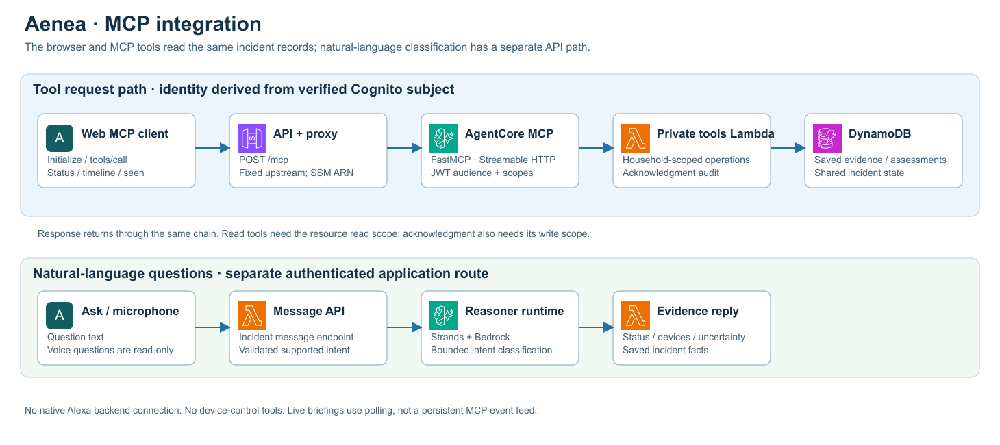

# API and event contracts

Application routes use API Gateway HTTP API. The deployed public `/config.json` provides `apiUrl`, `clientId` and `cognitoDomain`; these are identifiers, not credentials. Requests must use the authenticated household's records.

## Authentication

Sign-in uses Cognito authorization code flow with PKCE S256, verified OAuth state and an exact `/auth/callback` redirect. Scopes are `openid`, `email`, `<public API URL>/mcp/read` and `<public API URL>/mcp/write`; custom scopes belong to the same URL resource as the access token audience. There is no browser client secret. Self-registration is disabled.

Cognito uses the Essentials tier, Managed Login v2 and an app-client branding style. Classic hosted UI v1 does not support the resource-binding path required here. Authorization requests bind access tokens to the public `/mcp` resource; refresh retains that audience. After upgrading a Classic-login deployment, sign out and sign in once to obtain a newly bound session. Refreshing the old grant does not upgrade its original audience. AgentCore and tool-side signature/issuer/audience/client/scope checks remain enabled.

Application calls carry `Authorization: Bearer <access-token>`. MCP additionally verifies the resource audience `<apiUrl>/mcp`, issuer, signature, expiry, client ID, access-token type and scopes. Read permission is required for every tool; acknowledgment also requires write permission.

Access tokens last fifteen minutes; refresh tokens last one day. The browser enforces a one-day session deadline and refreshes tokens automatically. Temporary refresh failures preserve the session, while revocation/expiry requires sign-in. Sign-out cannot be undone by an in-flight refresh.

## Application endpoints

| Routes | Purpose |
| --- | --- |
| `GET /health` | Handler responsiveness; does not test all dependencies |
| `GET/PUT /household/catalog` | Read/save catalog with revision checks |
| `GET/PUT /household/simulations` | Read/save reusable definitions with revision checks |
| `GET /household/runs`, `GET /household/runs/{run_id}` | Paginated run list and one run |
| `POST /household/runs` | Start selected definitions with a stable request ID |
| `POST /household/runs/{run_id}` | Stop/resume a run |
| `POST /events` | Ingest one registered simulated device report |
| `GET /incidents` | Household-scoped incident list |
| `GET /incidents/{incident_id}/timeline` | Status and/or paginated records |
| `PUT /incidents/{incident_id}/name` | Rename with validated text |
| `POST /incidents/{incident_id}/resolve` | Resolve using current evidence/note revisions |
| `POST /incidents/{incident_id}/reassess` | Request reassessment of an open incident |
| `POST /incidents/{incident_id}/assessments/{assessment_id}/review` | Idempotent Agree/Reject review |
| `POST /incidents/{incident_id}/message` | Constrained incident questions and acknowledgment |
| `POST /incidents/{incident_id}/simulation-limit` | Deliberately extend practice allowance |
| `POST /incidents/{incident_id}/delete`, `GET /household/deletions` | Request and inspect evidence cleanup |
| `POST /incidents/{incident_id}/notes` | Compatibility API for unverified context; no new note UI |
| `POST /mcp` | Streamable HTTP JSON-RPC proxy |
| `GET /.well-known/oauth-protected-resource[/mcp]` | Public MCP resource metadata |

Mutating application routes require write scope. An incident ID is a UUID; readable names are separate labels. IDs and cursors remain scoped to the signed-in household.

Timeline `view=status` returns current incident, assessment, active devices, briefing and practice budget without the general audit page. `view=records` returns a page of records and a cursor without rebuilding current state. Omitting `view` returns the compatibility combined response. Status reads reject deleted incidents and mark a concurrently changed revision as refreshing.

## Device event envelope

New producers use Aenea envelope `1.1` around the IncidentBridge `1.0` event:

```json
{
  "contract_version": "1.1",
  "state": { "alarm": "active", "connectivity": "online" },
  "event": {
    "schema_version": "1.0",
    "event_id": "550e8400-e29b-41d4-a716-446655440000",
    "household_id": "authenticated-cognito-subject",
    "occurred_at": "2026-10-06T10:00:00Z",
    "source": {
      "source_id": "123e4567-e89b-42d3-a456-426614174000",
      "category": "sensor",
      "simulated": true
    },
    "kind": "smoke",
    "observation": "Smoke detector reports an active simulated alarm."
  }
}
```

The example IDs are illustrative: replace the subject and source with the actual authenticated identity and a device returned by its catalog. Omit `incident_id` for automatic assignment; provide a compatible open incident UUID for deliberate assignment. Optional `adapter` and `incident_name` fields are accepted. Automatic routing owns the title rather than accepting a client override.

Alarm state is `active`, `clear` or `unknown`; connectivity is `online`, `offline` or `unknown`. Connectivity loss never implies clearance. Both fields are mandatory for 1.1. Legacy 1.0 reports have unknown state.

Simulation definitions may add per-signal `severity`: `auto` (default), `informational`, `warning` or `urgent`. The worker carries an explicit choice as `state.simulated_severity` in the 1.1 envelope; it is persisted in receipt context and included in retry conflict checks. Only authenticated simulated sources can apply this exercise input. It is not a manufacturer measurement, model result or extension to the embedded IncidentBridge contract. Historical definitions without it retain automatic behavior. Clear state takes precedence over the chosen display severity. A validated AI assessment can raise overall incident urgency, but citing a report does not recolor its device.

Only enabled, registered simulation devices with a matching source category and supported signal kind are admitted. Source household must match authentication. Server context stores trusted catalog/location snapshots, receipt time and provenance; observation prose is untrusted.

Same event ID and identical content is a retry. Changing content, assignment or state under that ID returns conflict. A genuinely later repeat or state transition needs a fresh identity. Pending retries retain their first accepted context, even after catalog edits. Publication is at least once; correlation deduplicates evidence/counts.

## Simulation definitions and runs

Single definitions contain exactly one device/signal; scenarios contain at least two distinct devices. Duplicate single device/signal definitions are rejected, while scenarios may reuse sensors. A trigger batch cannot include one sensor through multiple selected recipes; the error names overlapping definitions.

A start request contains `request_id`, `definition_ids` and optional `incident_id`. Reuse the same request ID/body after an uncertain response. Runs retain pending event identities and scheduled timestamps. Device ownership prevents overlapping active runs; Stop releases future scheduling but cannot revoke an in-flight report.

## MCP tools



| Tool | Arguments | Behavior |
| --- | --- | --- |
| `get_incident_status` | `incident_id` | Latest assessment, active/reporting devices, state and freshness |
| `get_incident_timeline` | `incident_id`, optional `cursor` | One evidence/audit page |
| `acknowledge_incident` | `incident_id` | Atomic acknowledgment; does not resolve |
| `get_household_status` | `incident_id`, optional `cursor` | Read-only legacy person reports; no current safety inference |
| `get_responder_summary` | `incident_id` | Compatibility summary with partial indicator; contacts nobody |

Action tools and response-permission endpoints are absent. `GET /mcp` is 405; no persistent SSE subscription is provided. JSON-RPC initializes before tool calls and negotiates 2025-11-25. The browser can parse finite SSE replies but does not claim all optional MCP features.

A session 404 can reinitialize; only explicitly read-only tool calls replay automatically. An uncertain write must be checked before retrying. Requests/replies are bounded, and proxy/upstream errors never become successful outcomes.

## Errors and compatibility

Authentication failures return 401/403; validation 400; conflicts 409; removed incidents 410; oversized ingress 413; paused ingress 503. Tool errors carry protocol errors rather than fabricated data. Some failures pass through service-specific status codes.

Old timeline/context records receive a read-only compatibility projection. Unknown state or missing location stays unknown. Historical action/person records remain readable; new action execution and person reporting are unavailable. MCP tool calls never accept client-supplied owner authority.
