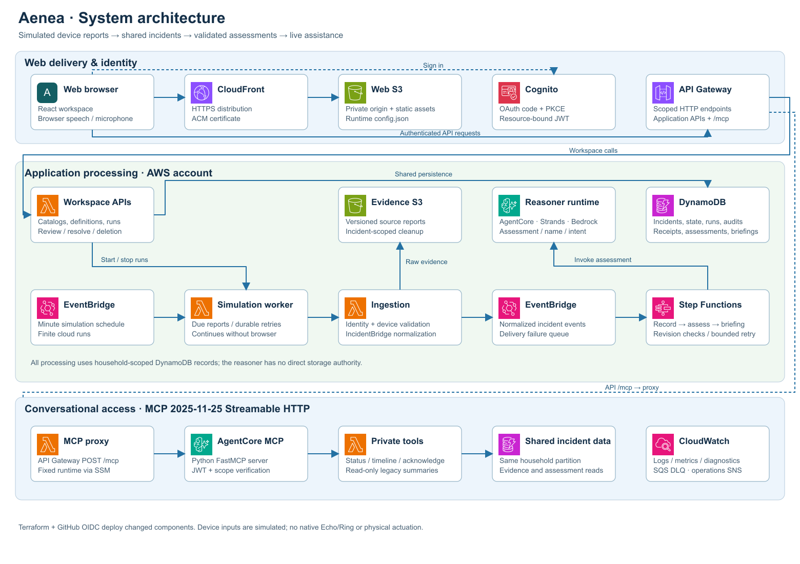
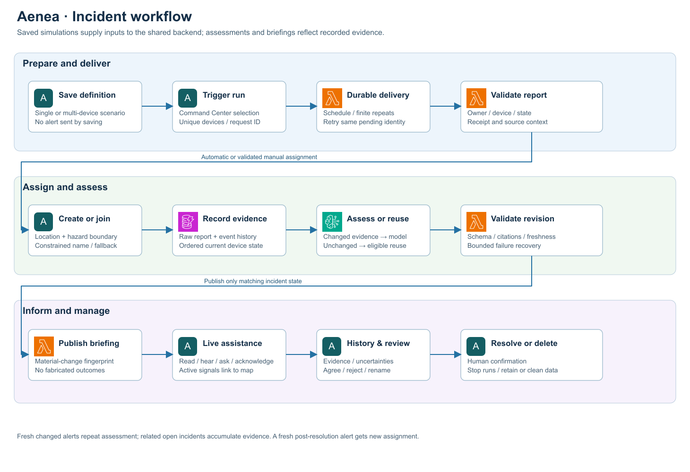
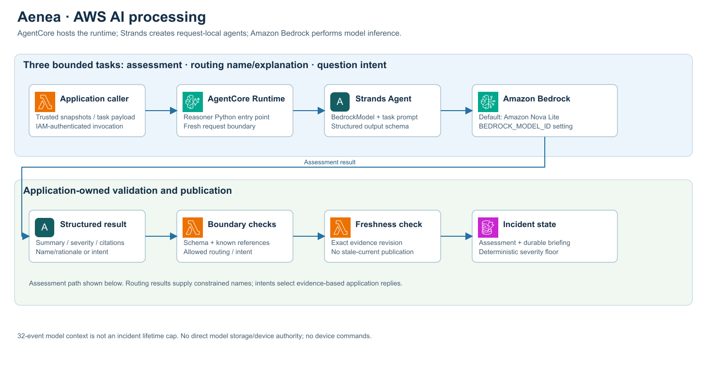

# Architecture

Aenea combines a device inventory, durable simulation producer, shared incident pipeline and conversational read interface. The current application uses one fixed Maple House template per authenticated identity: ten rooms, twenty-four initial sensors and separate private records for each account.

## System design

CloudFront serves the React application from a private S3 origin; ACM supplies HTTPS. Cognito authorizes access with OAuth code flow and PKCE. API Gateway routes authenticated application requests and MCP traffic to Lambda.

The workspace-management Lambda saves catalogs and simulation definitions, starts/stops runs, handles incident review and lifecycle requests, and publishes briefings. Its existing resource/source name `action_executor` remains for API compatibility; it performs no device actions.

An EventBridge minute schedule invokes the simulation worker. It reads durable run state, delivers due reports through the ingestion Lambda, and records delivery progress. Ingestion validates identity, catalog membership, source capability and state; normalizes the embedded event using IncidentBridge; reserves incident assignment and retry identity; stores source evidence in S3; then publishes an EventBridge incident event. Step Functions records correlated evidence, invokes assessment and publishes a revision-checked briefing.

DynamoDB stores catalogs, definitions, runs, receipts, incident summaries, evidence indexes, assessments, briefings and audits. S3 stores source evidence and runtime/frontend artifacts in separate buckets. CloudWatch provides logs and metrics; SQS retains failed event deliveries. The operations SNS topic requires an operator-configured subscriber. Systems Manager supplies the MCP runtime ARN to the proxy.

There is no Route 53 hosted zone, WAF, NAT gateway, always-running VM or native device adapter in this application stack. Domain DNS is configured externally.

## Incident workflow

Automatic assignment is deterministic at the location/hazard boundary. Fire/gas-related signals share a family; security-related signals share another; other kinds retain their own routes. A compatible open route joins an incident. Otherwise a new incident is reserved atomically. The model supplies a constrained name/explanation and cannot override the allowed create/join result. Explicit incident selection follows validated manual assignment and bypasses automatic model routing.

An unchanged source/kind can reuse routing context. Model failure has a recorded deterministic naming fallback. Conditional writes arbitrate concurrent first reports. Same-ID retries remain attached to their original incident; they do not create another incident or spend simulation allowance again.

Current device state follows report timestamps and stable event ordering, rather than arrival order alone. Delayed evidence is retained without replacing newer state. New changed evidence receives reassessment. A matching, unexpired assessment or unchanged-state result can be reused; material briefing changes have stable fingerprints.

Human resolution closes the route and cancels associated simulation generation. A fresh later alert may create a new incident. Stop, clear state, acknowledgment, review, resolution and deletion have separate meanings.

## Self-hosted MCP integration

The browser sends JSON-RPC over `POST /mcp` to API Gateway. A fixed-upstream Lambda proxy invokes the JWT-protected AgentCore MCP runtime. The Python MCP server verifies the token and invokes only the private tools Lambda; tools access the shared incident records.

The runtime uses MCP Python SDK 1.30.0, Streamable HTTP, stateless HTTP and JSON responses. The browser negotiates protocol `2025-11-25`, matches response IDs, and accepts JSON or bounded finite SSE responses. `GET /mcp` returns 405: there is no continuous event subscription. Live updates use authenticated polling instead.

Three shortcuts—status, timeline and acknowledgment—use MCP. Other natural-language questions use the application `message` endpoint and a constrained intent classifier. This separate path is shown explicitly rather than treating every UI interaction as an MCP call.

Cognito access tokens are bound to the API's MCP resource. Signature, issuer, expiry, client ID, access-token type, audience and scopes are checked; the verified subject determines household ownership. No model-provided household ID grants access. The complete tool and HTTP contracts are in [API](api.md).

This is a browser representation of Alexa+ interaction with a working self-hosted MCP implementation. It does not register with the native Alexa backend or connect to an Echo.

## AWS AI processing

The reasoner is a separate IAM-authenticated Bedrock AgentCore runtime. Each request creates a fresh Strands agent backed by `BedrockModel`; the Terraform default is `amazon.nova-lite-v1:0`. `BEDROCK_MODEL_ID` determines the configured runtime model.

| Task | Input and model role | Application boundary |
| --- | --- | --- |
| Assessment | Bounded current evidence, aggregates and unverified legacy notes; produces incident type, severity, summary, confidence, references and uncertainties | Schema/citation validation; matching evidence revision; deterministic severity floor |
| Routing explanation | Trusted location/family, allowed create/join and candidate incident | Model names/explains; deterministic code owns assignment; reuse/fallback may avoid inference |
| Question classification | Up to 600 characters of incident question | Selects status topic, timeline, acknowledgment or unsupported; application constructs the evidence-based reply |

Assessment requests contain at most 32 representative evidence events and a bounded payload, while the full history stays in storage. This is a model-context bound, not an incident lifetime limit. Unchanged evidence can reuse an eligible assessment. Failures remain visible and retries are bounded.

New assessments accept no device commands. The reasoner has no database or device-control authority. Citation checks verify supplied references, not the physical truth of sensor reports. A current model assessment may raise urgency, but cannot lower the deterministic signal floor.

## Shared data and security boundaries

One Cognito identity owns one dataset. A shared guest identity therefore shares its test records with other users of that identity. Fixed house IDs and room names do not merge data across account partitions.

Catalog edits use revision checks. Source context stores device/location snapshots at receipt time; current names may be display fallbacks but never rewrite historical location. Historical action/person records remain read-only for compatibility.

Status reads reuse a revision-matched device projection or reconstruct from paged evidence. Evidence pagination is separate from live status. Open incidents poll every ten seconds, resolved incidents every sixty seconds, and the incident list every thirty seconds; hidden tabs skip polling. These intervals are not a latency guarantee.

See [Deployment](deployment.md), [Operations](operations.md) and [API](api.md) for configuration, recovery and contracts.

Editable diagram sources: [system](diagrams/system-architecture.svg), [workflow](diagrams/incident-workflow.svg), [MCP](diagrams/mcp-flow.svg), [AI processing](diagrams/ai-processing.svg). PNG copies are provided for documents and presentations.
